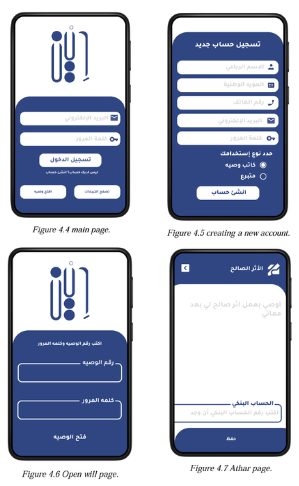
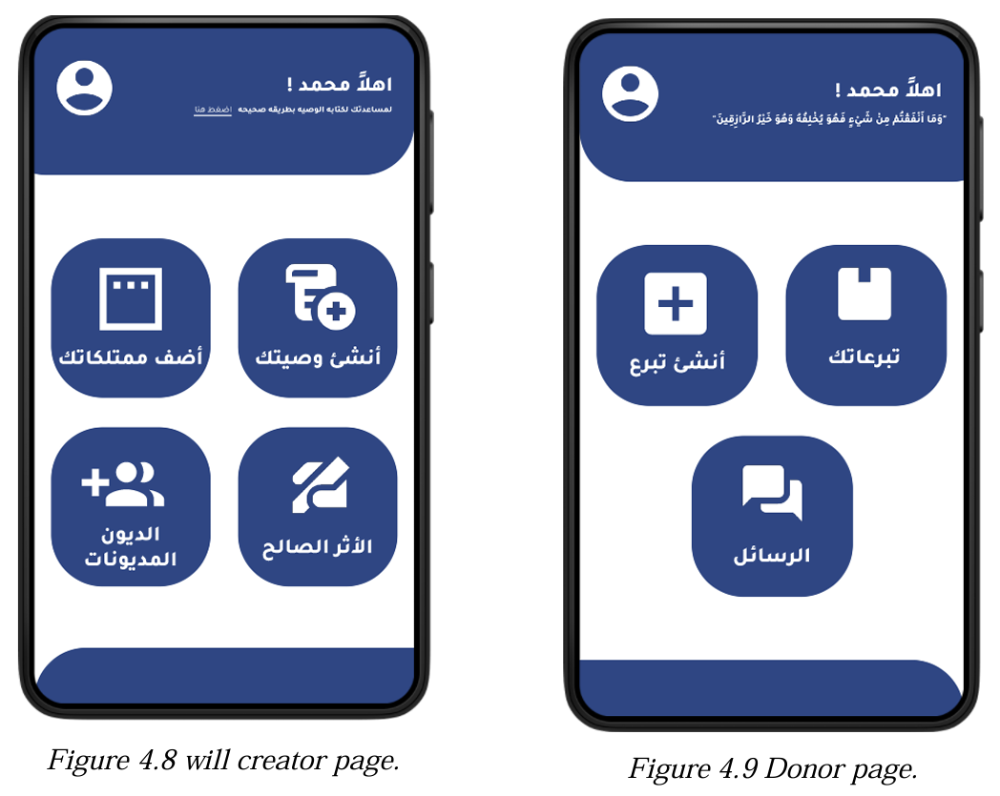
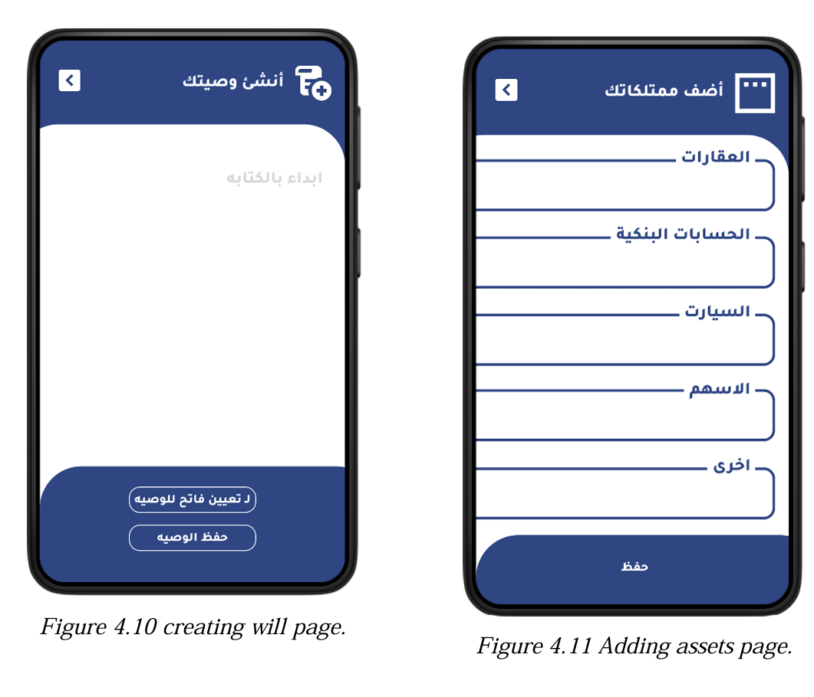
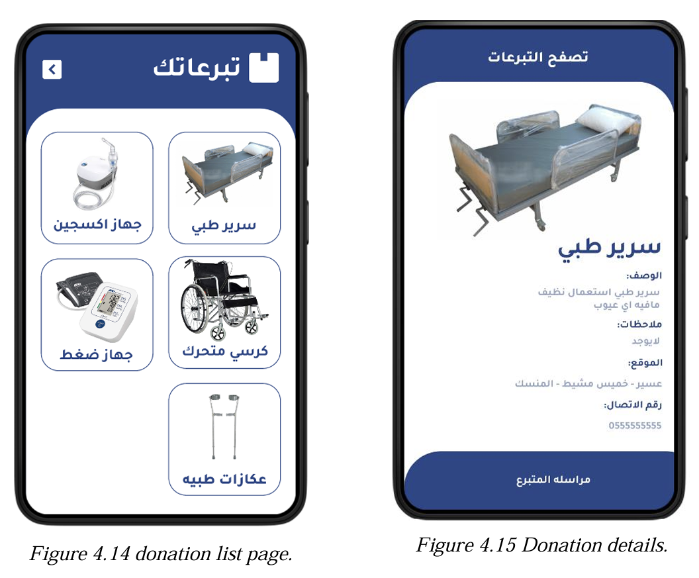

<!-- 🔥 HEADER -->
<h1 align="center"> Electronic Will Management app </h1>

  <b>A Secure Digital Solution for Managing Wills Efficiently</b>

  

<h2> Application Interface</h2>

<table>
<tr>
<td align="center" width="50%">
 
<b>🔐 Secure Login</b> 
Ensures user identity protection and secure access
</td>

<td align="center" width="50%">
 
<b>🏠 Dashboard</b> 
Central control for managing wills and user data
</td>
</tr>

<tr>
<td align="center">
 
<b>📝 Create Will</b> 
Structured process for writing and organizing wills
</td>

<td align="center">
 
<b> Asset Distribution</b> 
Flexible management of beneficiaries and donations
</td>
</tr>
</table>

<h2>🎯 Problem Addressed</h2>

Traditional will management is complex and lacks secure digital solutions. This system simplifies the process by providing a structured and secure platform.

<h2>💡 Proposed Solution</h2>

A centralized digital system that allows users to create, store, and manage wills efficiently and securely.

<h2>🧠 System Design</h2>

📌 Use Case Diagram 
📌 ER Diagram 
📌 Class Diagram 
📌 Database Structure

<h2>🚀 Project Strengths</h2>

✔ Secure handling of sensitive data 
✔ Real-world applicable system 
✔ Scalable architecture 
✔ User-centered design

<h2>👩‍💻 My Contribution</h2>

- Designed system workflow and architecture 
- Built database structure and relationships 
- Translated user requirements into system features

<h2>📎 Documentation</h2>

Full project report is available in the attached PDF file.

